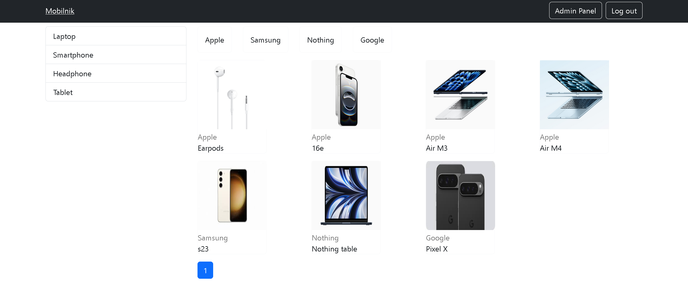

# Online store clone
This is a web application of an online store  
Took Mobilnik Astana as an example
REST API for get, post, delete data in db  
Auth process with JWT  

## practicing PERN stack:  
postgresql | pg, pg-hstore - systems of managing database  
express.js  
react.js  
node.js  
  
sequelize - ORM for relational db in node.js  
cors - browser-to-server management  
dotenv - give variables to the environment  
nodemon - dev dependency, does refresh server automatically with file changes  
axios - send requests to the server  
react-router-dom - page navigation  
mobx - state manager  
mobx-react-life - connect mobx with functional components of react.js  
bootstrap  
  
## Screenshots

//to-do: delete/put methods  
:)